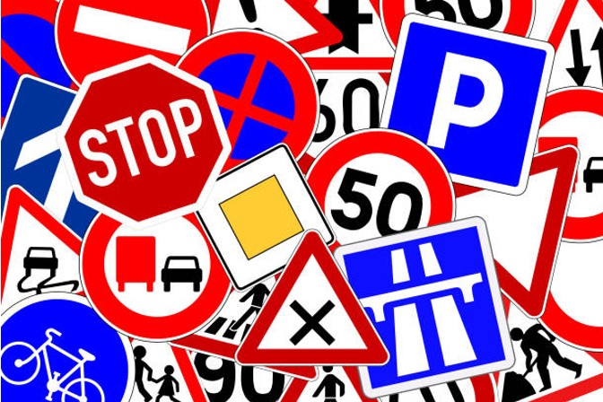

# German Traffic Signal Recognition

    <h1>GERMAN TRAFFIC SIGNAL RECOGNITION!   Group 13   Professor: Ran Feldish</h1> 
    

**Authors**:

Sidhartha S Mondal

Bharat Sharma

Prithu Bradhwaj

Chirag Bhatia

## Note : "Data set are not provided in the repo please download it from the following Link"
Dataset Link : https://www.kaggle.com/datasets/meowmeowmeowmeowmeow/gtsrb-german-traffic-sign

## Abstract

In the context of autonomous vehicles, accurate traffic sign recognition
is crucial for safe navigation. This project presents custom
Convolutional Neural Network (CNN) and YOLO models for multi-class
traffic sign classification and detection using the GTSRB dataset. The
CNN model categorizes cropped sign images, while YOLOv5 and YOLOv8
detect signs in full road scenes. Models are optimized through transfer
learning, augmentation, and regularization. Rigorous evaluation shows
strong performance, with precision and recall exceeding 90% for
classification and high mean average precision for detection. The
optimized models provide reliable recognition in challenging real-world
conditions, enhancing automated navigation.

## Introduction

Reliable detection of traffic signs is vital for the safety of
autonomous vehicles. This project focuses on developing deep learning
models, including custom CNNs and YOLO architectures, for multi-class
traffic sign classification and detection. The models are trained on
real-world images of German traffic signs and address challenges such as
distance, perspective, and lighting conditions. The evaluation
demonstrates robust performance, with classification achieving over 90%
precision and recall, and detection showing high mean average precision.
The models generalize well and hold promise for enhancing autonomous
driving systems.

## *Related* Work

Deep learning techniques, particularly CNNs, have been extensively
studied for traffic sign recognition. This project introduces YOLO
models, including YOLOv3 and YOLOv5, for both classification and
detection. While YOLO\'s speed and accuracy benefits have not been fully
explored in this context, this project showcases their effectiveness.
Additionally, a novel batch processing method accelerates training
efficiency. The project bridges the gap between classification and
detection using advanced technologies.

## Data

The project uses the GTSRB dataset consisting of train and test images.
The dataset contains bounding box coordinates and class labels for
various traffic signs. Data augmentation, sharpening, and normalization
enhance model training. For YOLO models, annotation conversion,
batching, and resizing optimize training. The project\'s findings are
based on 39,210 training images, 12,631 test images, and a memory usage
of 800 MB.

## Conclusion

The project contributes to safer autonomous driving through effective
traffic sign recognition. Custom CNNs and YOLO models provide accurate
classification and detection, even in challenging conditions. By
integrating these models into self-driving car systems, the project
enhances road safety and advances transportation efficiency.

For detailed information, refer to the full report in the GitHub
repository.
